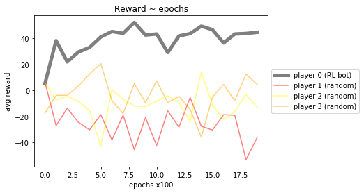

# Schafkopf_RL
Reinforcement Learning applied on the Bavarian card game 'Schafkopf'

## Approach:
Player 1 (RL bot) is learning, while players 2-4 are acting random. Afterwards update players 2-4 so they act according to the Q Network while player 1 while player 1 is learning again.

## Set up:
| module               | content                                                          | 
| -------------------- |:----------------------------------------------------------------:|
| rules.py             | definition of cards, scores, games, rewards and helper methods   |
| state_overall.py     | states which are valid for every player                          |
| state_player.py      | states which are valid for single player                         |
| playing_schaflopf.py | hyperparameters for NNs, training Q Networks                     |
| QL_choose_game.py    | Q Network architechture and Memory for choosing game             |
| QL_select_card.py    | *not implemented yet*                                            |
| script.py            | script                                                           |

## Next steps:
| Action                                     |                                                |
| -------------------------------------------|:-----------------------------------------------|
| set state davongelaufen                    | identify if player davongelaufen in play()     |
| QL for selecting cards                     |                                                |
| QL for doppeln                             |                                                |
| Stock                                      |                                                |
| select game process simplified right now   |                                                |
| Tout, Sie                                  |                                                |

## Results:
### Reward ~ epochs after implementing QL for choosing game
Player 1 = choosing game based to dealed cards as a state and NN, but playing cards random  
Players 2-4 = acting completely random 

